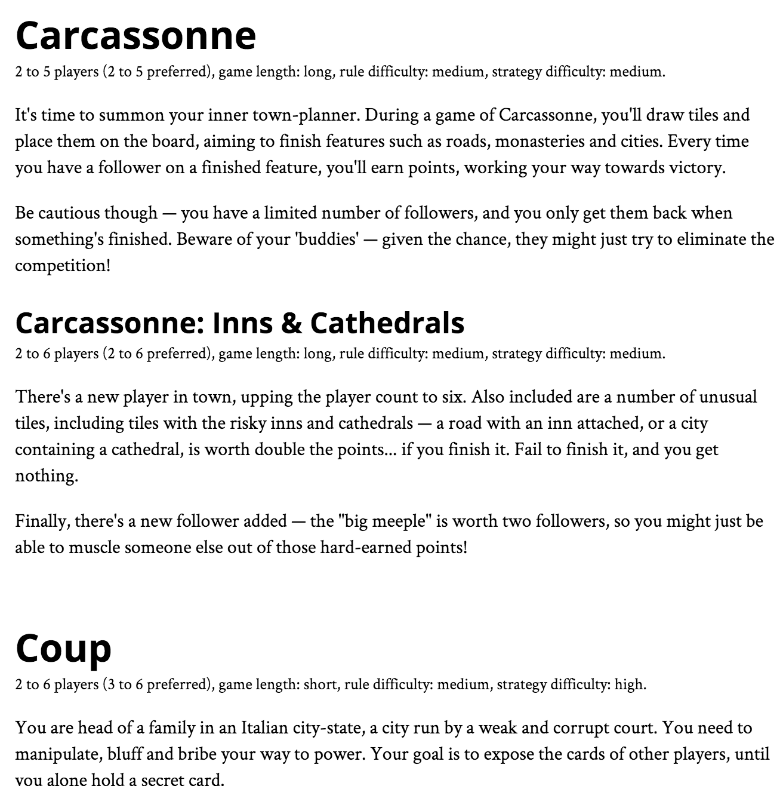

# Game Exhibitor

> Latest release is running via free Heroku at https://game-curator.herokuapp.com/

Small app to put together a booklet of available board games for visitors.
[Contributions big and small welcome!](CONTRIBUTING.md)

Hacked together in a night — don't expect pretty. :)

## Sample Output

## Installation Instructions for Contributors

1. Install [NodeJS](https://nodejs.org).
2. Run `npm install` in cloned source directory.
3. Run `npm start` to start the application.
4. Go to [http://localhost:3000](http://localhost:3000) to use the application.

## Contributors

Thanks to @eamq!
